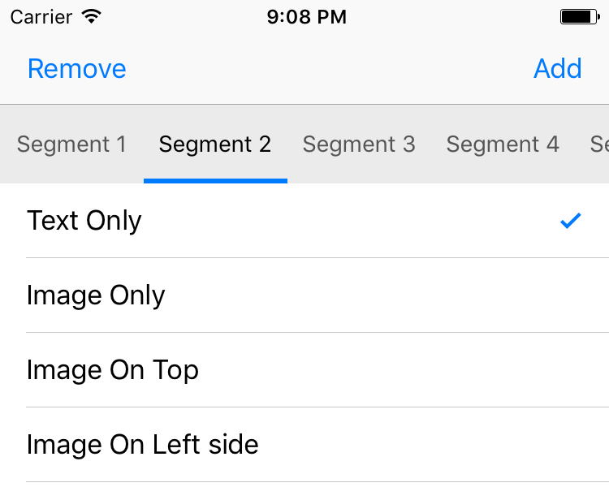
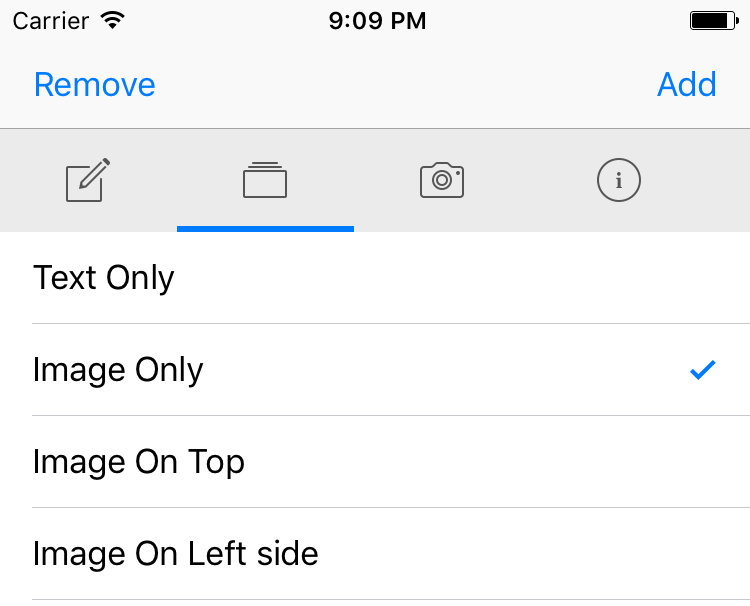
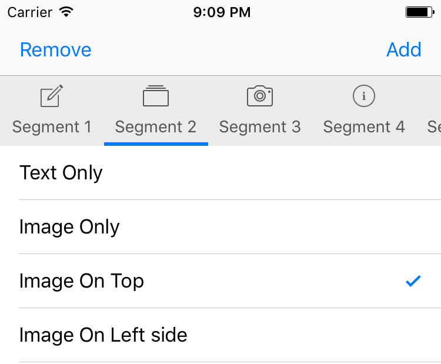
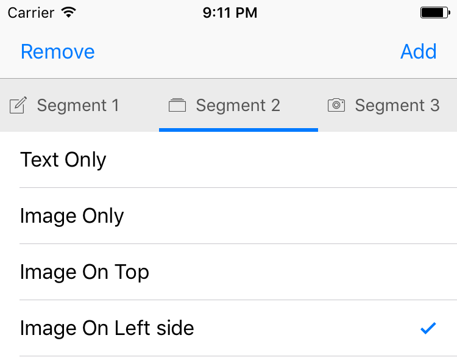

# ScrollableSegmentedControl

[](https://travis-ci.org/GocePetrovski/ScrollableSegmentedControl)
[](http://cocoadocs.org/docsets/ScrollableSegmentedControl)
[](http://cocoadocs.org/docsets/ScrollableSegmentedControl)
[](http://cocoadocs.org/docsets/ScrollableSegmentedControl)

ScrollableSegmentedControl is replacement for UISegmentedControl that becomes scrollable when the total width of all segments exceeds the width of the control itself. 

ScrollableSegmentedControl supports 4 styles of segments: text only, image only, text with image on top and text with image on left. 

|           Text Only           |           Image Only            |
|-------------------------------|---------------------------------|
|    |     |


|           Image On Top        |           Image On Left         |
|-------------------------------|---------------------------------|
| |  |


### Support

- Xcode 10.2+
- Swift 5.0+
- iOS 9.0+


# Usage

ScrollableSegmentedControl is designed to be used exactly same as UISegmentedControl. methods and properties are deliberately named same or very similar to ones found in UISegmentedControl.

```swift
@IBOutlet weak var segmentedControl: ScrollableSegmentedControl!
    
override func viewDidLoad() {
    super.viewDidLoad()

    segmentedControl.segmentStyle = .textOnly
    segmentedControl.insertSegment(withTitle: "Segment 1", image: #imageLiteral(resourceName: "segment-1"), at: 0)
    segmentedControl.insertSegment(withTitle: "Segment 2", image: #imageLiteral(resourceName: "segment-2"), at: 1)
    segmentedControl.insertSegment(withTitle: "Segment 3", image: #imageLiteral(resourceName: "segment-3"), at: 2)
    segmentedControl.insertSegment(withTitle: "Segment 4", image: #imageLiteral(resourceName: "segment-4"), at: 3)
    segmentedControl.insertSegment(withTitle: "Segment 5", image: #imageLiteral(resourceName: "segment-5"), at: 4)
    segmentedControl.insertSegment(withTitle: "Segment 6", image: #imageLiteral(resourceName: "segment-6"), at: 5)
        
    segmentedControl.underlineSelected = true
        
    segmentedControl.addTarget(self, action: #selector(TableViewController.segmentSelected(sender:)), for: .valueChanged)

    // change some colors 
    segmentedControl.segmentContentColor = UIColor.white
    segmentedControl.selectedSegmentContentColor = UIColor.yellow
    segmentedControl.backgroundColor = UIColor.black
    
    // Turn off all segments been fixed/equal width. 
    // The width of each segment would be based on the text length and font size. 
    segmentedControl.fixedSegmentWidth = false
}
    
func segmentSelected(sender:ScrollableSegmentedControl) {
    print("Segment at index \(sender.selectedSegmentIndex)  selected")
}
```

Using appearance proxy to change some colors

```swift
func application(_ application: UIApplication, didFinishLaunchingWithOptions launchOptions: [UIApplicationLaunchOptionsKey: Any]?) -> Bool {
    let segmentedControlAppearance = ScrollableSegmentedControl.appearance()
    segmentedControlAppearance.segmentContentColor = UIColor.white
    segmentedControlAppearance.selectedSegmentContentColor = UIColor.yellow
    segmentedControlAppearance.backgroundColor = UIColor.black

    return true
}
```

Configuring custom title attributes via setTitleTextAttributes method

```swift
let largerRedTextAttributes = [NSAttributedStringKey.font: UIFont.systemFont(ofSize: 16), NSAttributedStringKey.foregroundColor: UIColor.red]
let largerRedTextHighlightAttributes = [NSAttributedStringKey.font: UIFont.systemFont(ofSize: 16), NSAttributedStringKey.foregroundColor: UIColor.blue]
let largerRedTextSelectAttributes = [NSAttributedStringKey.font: UIFont.systemFont(ofSize: 16), NSAttributedStringKey.foregroundColor: UIColor.orange]

segmentedControl.setTitleTextAttributes(largerRedTextAttributes, for: .normal)
segmentedControl.setTitleTextAttributes(largerRedTextHighlightAttributes, for: .highlighted)
segmentedControl.setTitleTextAttributes(largerRedTextSelectAttributes, for: .selected)
```

See the Demo project for example on how to use it. 


# Installation

### CocoaPods
The easiest way of installing ScrollableSegmentedControl is via [CocoaPods](http://cocoapods.org/). 

```
pod 'ScrollableSegmentedControl', '~> 1.5.0'
```

### Old-fashioned way
Just add `ScrollableSegmentedControl.swift` to your project.
